# Introduction to SQL

## Summary

Through this tutorial I was able to learn multiple commands in order to utilize a SQL Database. I learned how to Query a table in order to sort the information inside the table and how to put further constraints in order to narrow down my search. I also learned how to insert new information into the table, update the information inside and selectively delete that information.I now also know how to create new tables, Alter their rows and columns and how to delete the entirety of the table. Through the use of queries I can also now use multiple tables and have the ability to join their information together for a more robust set of information.

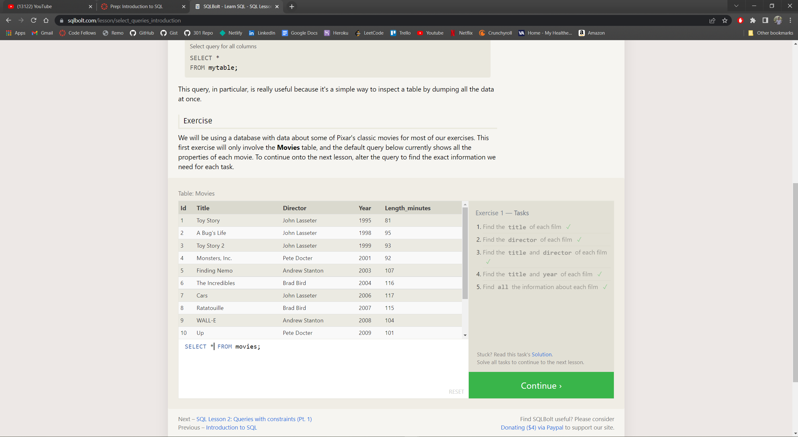

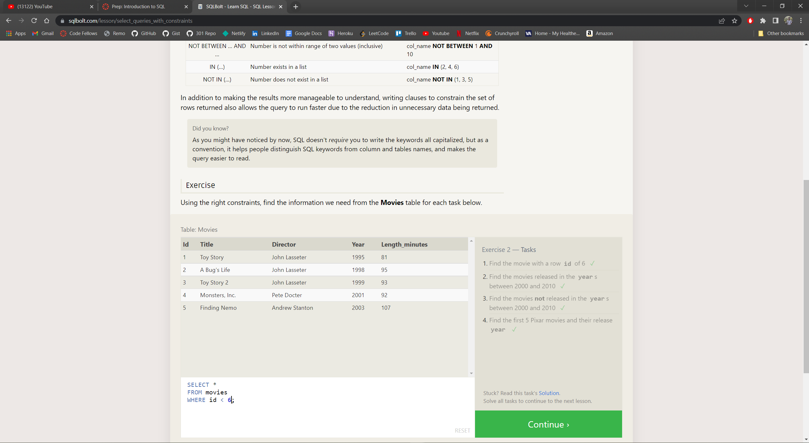

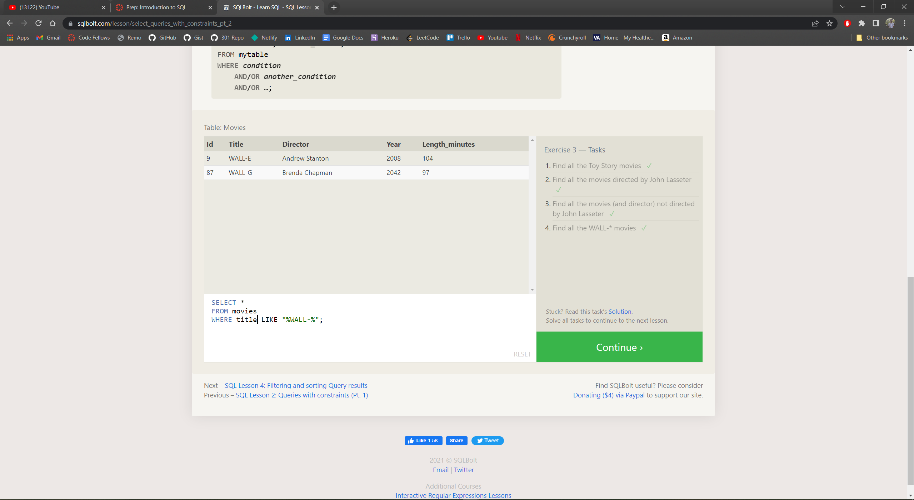

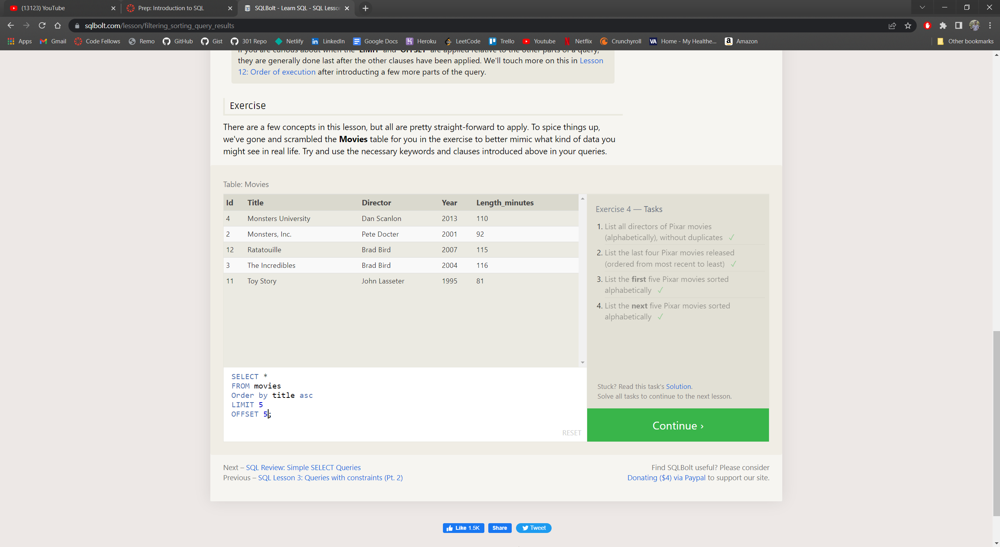

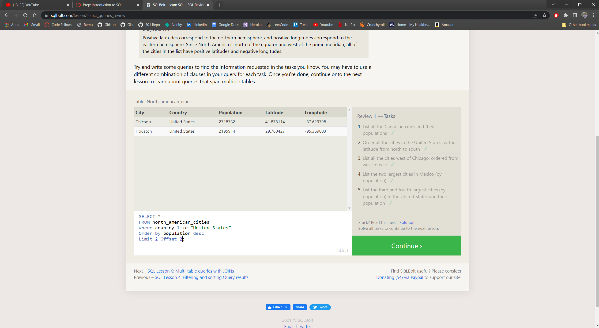

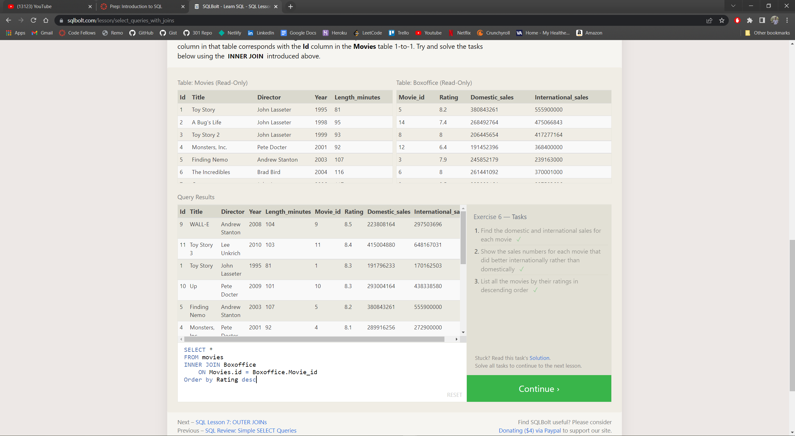

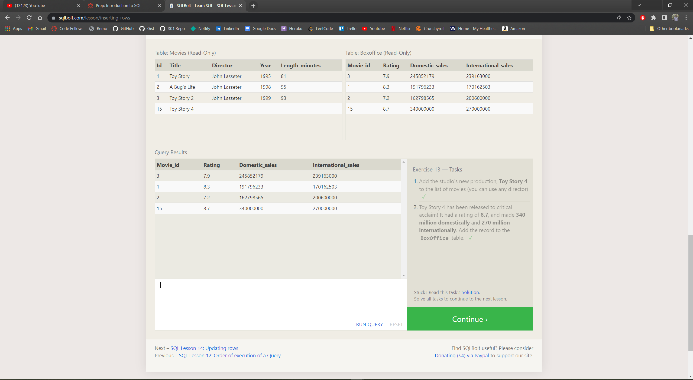

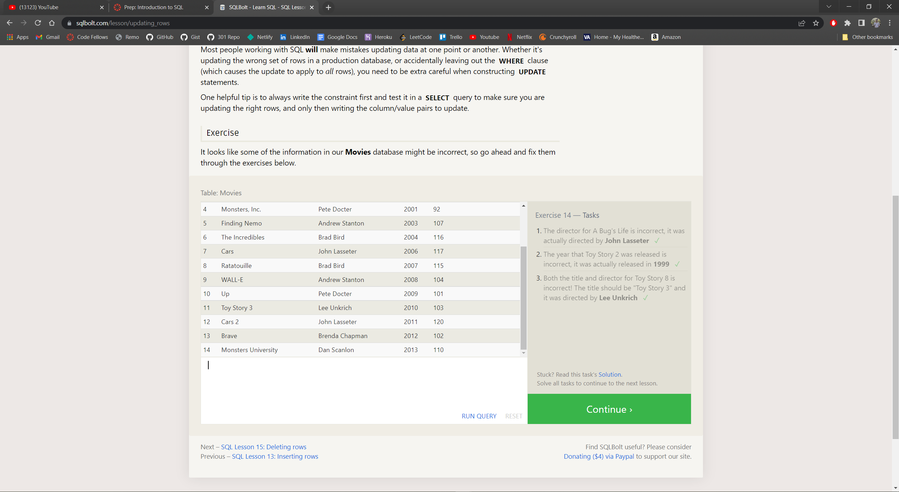

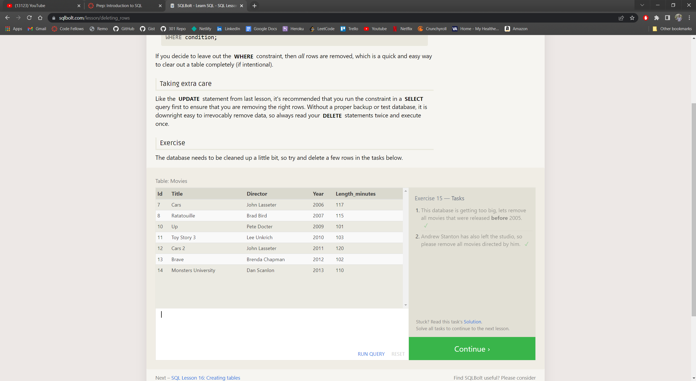

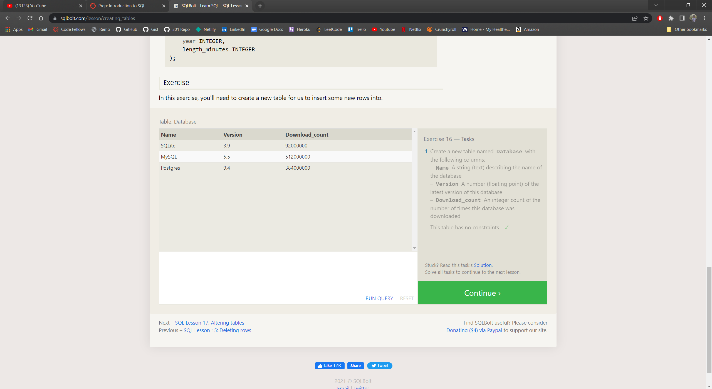

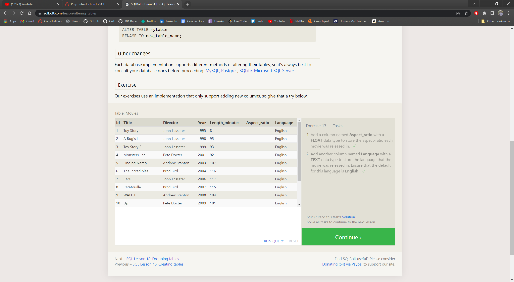

[Return to Code 401 Table of Contents](https://rogermreyes.github.io/Reading-Notes/Code-401-Reading-Notes)
